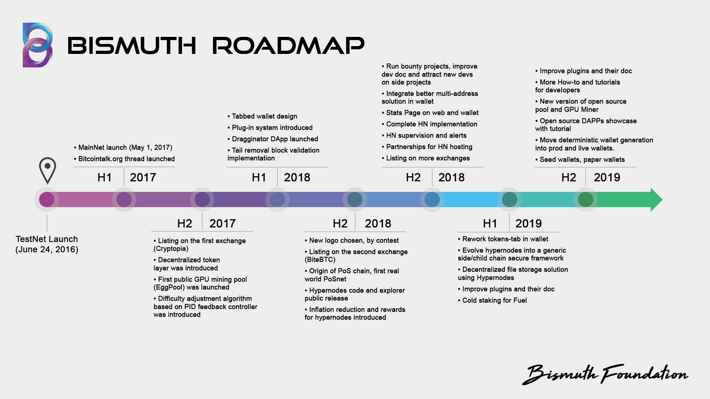

# Roadmap
Dev team roadmap document: this document shows the short-, mid- and long-term development plans of the dev team, as well as bounty projects where contributions from new developers are welcome.  
As activities are completed, they are moved down to the "Completed" list.  
This document should be updated fairly frequently.

> Note: PoW fork on October 8 was not planned in this Roadmap. Needed much research, tests and energy.
Was needed to avoid centralization, see https://github.com/bismuthfoundation/mining-algos/blob/master/Docs/Fork-FAQ.md for more info

> Note2: Dev efforts on the legacy wallet have been postponed due to the new gen "Tornado" Wallet.

## Short-Term (0-3 months)
Below is a list of activities, features and projects expected to be completed within 3 months:  
* Run bounty projects, improve dev doc, attract new devs on side projects. This is an ever going task.
* Better support for tokens and multiaddresses in wallets
* Add tokens features to official block explorers
* Stats Page on web and wallet (for wallet-servers and more)
* Add Hypernodes supervision and alerts in Wallet and Pawer bot.
* Add Features to the Pawer Discord Bot.
* Push the new gen Tornado wallet out of beta (needs security audits)
* Add features and themes to the new gen Tornado wallet
* Dev docs to open wallet dev (themes as well as Crystals) to external devs
* New bootstrap solution, and blockchain verification - In Testing stage
* Develop partnerships around Hypernode hosting - Still ongoing
* Ever going effort to get listed on more - reliable - exchanges.
* rewrite of core code to ease maintenance and external devs adoption
* optimization of sql requests and DB access

## Mid-Term (3-6 Months)
Below is a list of activities, features and projects expected to be completed within 3-6 months:  
* Decentralized file storage solution using Hypernodes
* Open source DAPPs showcase with tutorial: go on with "Hack with Bis" repo and more tutorials
* Improve plugins and their doc
* More How-to and tutorials for devs
* New version of open source pool and GPU Miner
* Work on an unified websocket API, with consistent naming of methods.
* Official API for instant addresses balance requests (BIS as well as Tokens)
* Cold staking for Fuel
* Hyperlane Technology
* Work on an official Whitepaper
* Website redesign and re-organisation

## Long-Term (6+ Months)
Below is a list of more long-term activities, features and projects expected to take longer than 6 months to complete:  

* Move deterministic wallet generation into prod and live wallets.  
  Seed wallets, paper wallets - Needs more research for security reasons.
* Generalize the Hypernode technology into a side/child chain secure framework.
* Real world use case of the Hyperlane Technology

## Future Research Areas
* Bulletproofs: https://crypto.stanford.edu/bulletproofs
* State channels smart protocols
* Private Smart Contracts https://petsymposium.org/2018/files/hotpets/9-goldfeder.pdf
* Embedded hardware devices, smart wallet appliances

## Bounty Projects
Below is a list of projects where the dev team welcomes contributions from new devs:  

* BISafe  
A safe, Html wallet for Bismuth Cryptocurrency.  
https://github.com/EggPool/BISafe  
Bounty address: https://hypernodes.bismuth.live/?ac=0ee5609ee98f329b378d6a520afc8dec56092511ddc7ae00e0b790ce&page_id=152

* Alliage  
Electrum wallet for Bismuth  
https://github.com/bismuthfoundation/alliage  
Initial Bounty: 1000 BIS (will increase)  
  

* WordPress open source e-commerce plugin for Bismuth  
Depending on Twitter votes (Magento, Prestashop, WooCommerce, Other)

## Suggestions
Projects that are discussed and could enter in the roadmap once the timeframe is defined.

* Tokens explorer
* Hypernodes metrics and reward explorer
* BIS Hackaton
* Potential Fork to get the PoW algo more Asic and FPGA resistant
* Support of ECDSA addresses on mainnet in addition to current RSA scheme

## Completed
As activities from the lists above are completed, they are moved to here showing date completed:  
* 2018-12-16: New gen Tornado wallet supports Crystals to add extra features
* 2018-12-14: 18 Translations completed by the community in an awesome effort!
* 2018-12-10: Alpha version of the new gen translatable Wallet, using the BismuthClient package.
* 2018-12-02: First official release of the Pawer Discord bot (Iyomisc). Bismuth wallet straight from Discord.
* 2018-11-29: Bismuth listed on TradeSatoshi
* 2018-11-29: Bismuth on Delta Direct
* 2018-11-..: Several contributions from community devs (API ticker from Cipery, Client libraries from LeMoussel)
* 2018-11-22: EasyRabbit integration
* 2018-11-20: Official release of "Hack with BIS", series of tuto for developers to build on BIS
* 2018-11-17: Bismuth listed on QTrade
* 2018-11-17: First release of the "BismuthClient" python package, to ease clients and dApps development.
* 2018-11-15: Bismuth on Blockfolio signal
* 2018-11-15: Antimony console wallet Beta - Targeted toward devs and automation freask.
* 2018-10-30: Official Wallet server API and integration in light Wallet
* 2018-10-20: Bismuth node now supports regtest mode
* 2018-10-08: New mining algorithm successfully launched (Bismuth Heavy3)
* 2018-09-11: Comprehensive guide for future exchanges "How to Implement Bismuth"
* 2018-09-08: Hypernode network up-and-running, first weekly payout
* 2019-08-31: 54 Hypernodes running, 1 000 000 $BIS Hypernodes collateral mark
* 2018-08-31: Inflation reduction, rewards for hypernodes
* 2018-08-29: Hypernodes code and explorer public release
* 2018-08-20: Origin of PoS chain, first real world PoSnet
* 2018-07-31: Second exchange (BiteBTC)
* 2018-07-18: Logo contest, new logo
* 2018-06-22: Tail removal block validation
* 2018-06-13: Dragginator DApp
* 2018-05-30: Plug-in system
* 2018-05-15: Tabbed wallet design
* 2017-12-15: Difficulty adjustment algorithm based on PID feedback controller
* 2017-11-18: First public GPU mining pool (EggPool)
* 2017-10-01: Decentralized token layer
* 2017-09-30: First exchange (Cryptopia)
* 2017-05-01: Mainnet launch and bitcointalk thread opened
* 2016-06-24: Testnet launch

 
